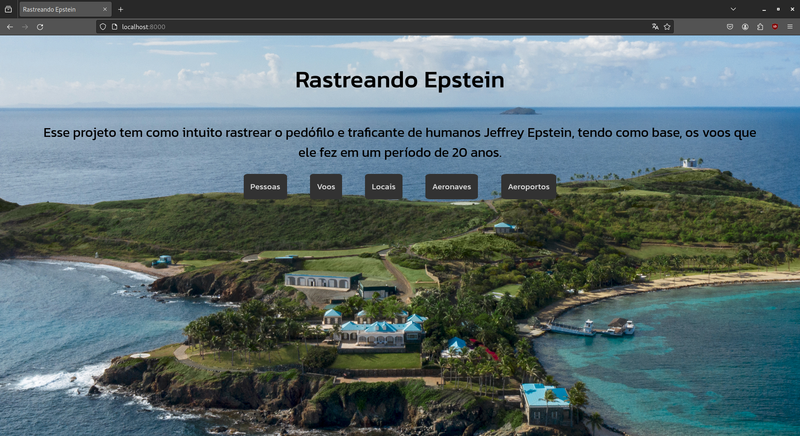
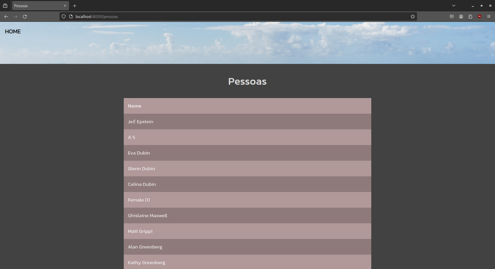
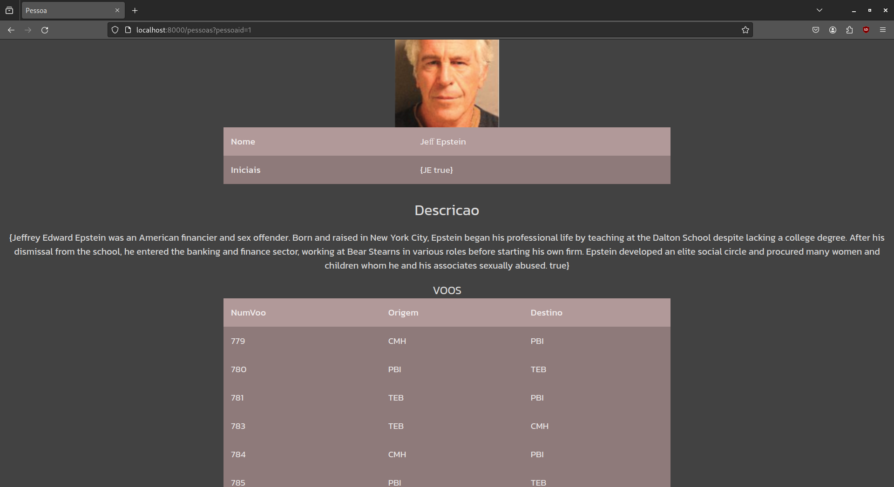
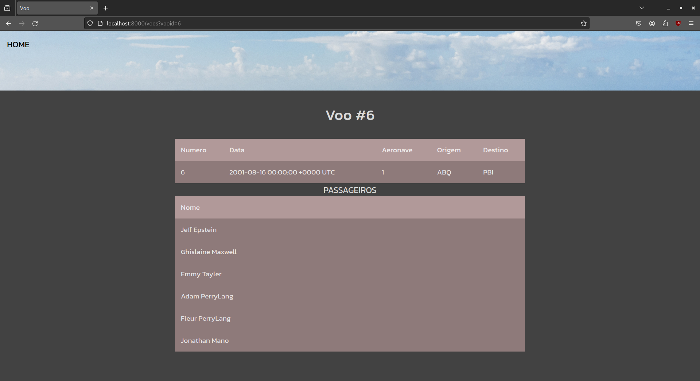
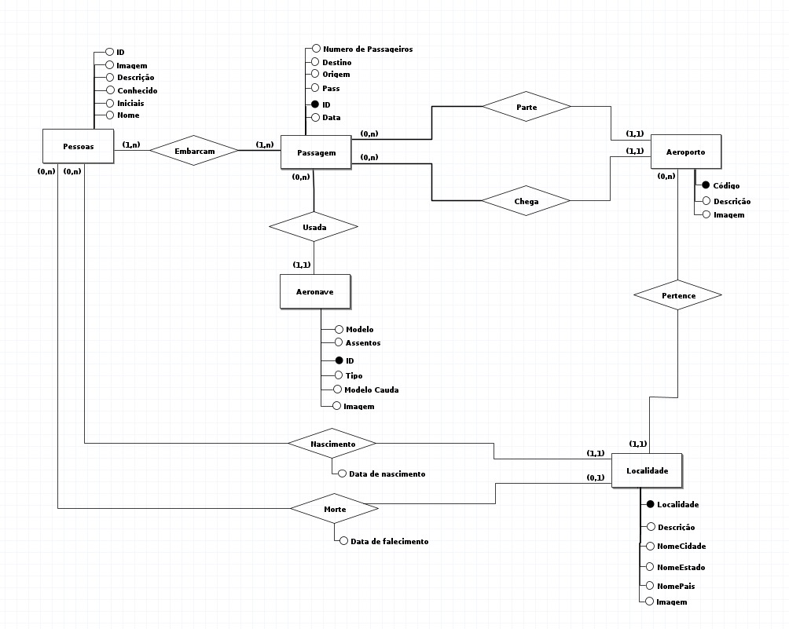
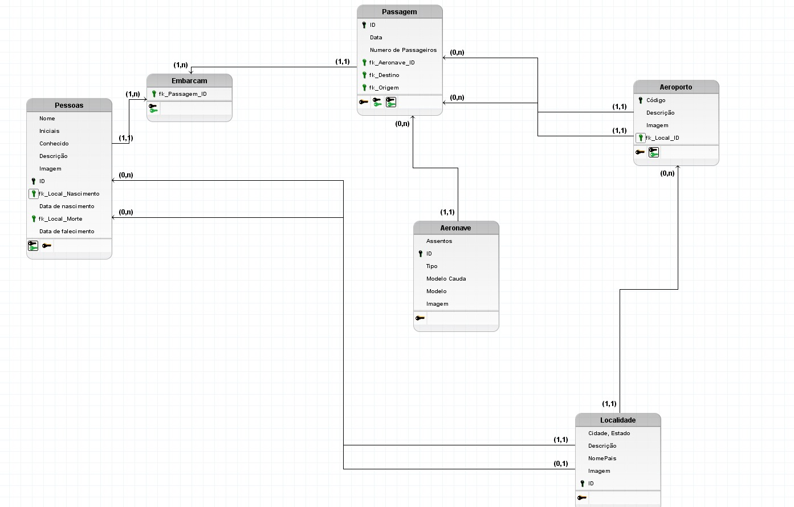

# Relatório do Projeto de Banco de Dados

`Disciplina`: Banco de Dados ICP-489

`Professora`: VIVIAN DOS SANTOS SILVA

`Alunos`:
- ARTHUR SOBRINHO FERREIRA DA ROCHA
- BRENO MARTINS SILVA
- FERNANDO GIONGO OLIVEIRA
- HENRIQUE LIMA CARDOSO

A apresentação de slides (canvas) pode ser vista em [aqui](https://www.canva.com/design/DAF2HkRTCow/_hkF4d4rpdQAPzVuAKFlxA/edit?utm_content=DAF2HkRTCow&utm_campaign=designshare&utm_medium=link2&utm_source=sharebutton).

Para o projeto, navegando na internet, encontramos este link: https://www.howellwoltz.com/uploads/1/7/0/4/17044718/flight_logs.pdf.

Nele há um pdf (que foi convertido para xlsx - excel) contendo viagems do bilionário (agora morto) [Jeffrey Epstein](https://en.wikipedia.org/wiki/Jeffrey_Epstein) e pessoas que acompanharam-lo em viagems.

Varios nomes famosos aparecem, entre eles:

- Prince Andrew
- Donald Trump
- Bill Clinton

São alguns deles.

---

Existem 2 programas de fato nesse repositório:
1.   prog2 (que é o programa que hospeda o site no port localhost:8000)
2.   preenche (contido na subpasta internal) que de fato preennche o banco de dados

É convertemos (usando o LibreCalc) o arquivo xlsx para um CSV e usando as bibliotecas nativas de Go, fizemos as leituras dos campos e buscamos (concorrentemente) na Wikipedia informações sobre cada entidade interessante que aparece no arquivo.

O frontend foi feito todo usando templates em Go também, (todas bibliotecas nativas, principalmente porque ninguém do grupo já estagiou e não tinhamos experiência com web-dev). Colocamos, no entanto, um css para a melhor visualização (estava muito feio durante a apresentação)

## Home

## Pessoas

## Pessoa

## Voos

## Queries
As queries feitas podem ser vistas em `banco.go` . 

Uma coisa é importante afirmar, o banco não está de fato completo, pois não conseguimos adquirir as informações sobre local de nascimento, morte e datas de nascimento e morte sobre as pessoas. 

Idealmente, o projeto está apto para receber essas informações e elas seriam adicionadas entre paginas de locais e pessoas.

Os modelos físicos e relacionais foram modelados de acordo com essa funcionalidade, mas a fim de apresentação julgamos que o site - por mais que incompleto, estivesse suficiente.

Em `epstein/internal/modelo` encontram-se o banco de dados que criamos e utilizamos. (Há também um banco falso que usamos para testar o site - que está de acordo com todas as funcionalidades)

---

Os diagramas do desenvolvimento o projeto podem ser vistos com mais detalhes em `readmefile/diagramas`

## Diagrama Modelo Conceitual

## Diagrama Modelo Físico

--- 

Por mais que feito com desespero, esse projeto foi certamente um dos mais divertidos que fizemos na faculdade, um tema espinhoso e excêntrico foi legal de tratar.

É importante reiterar, nem todos da lista são de fatos envolvidos com o monstro que foi Jeffrey Epstein. 

Esse projeto **NÃO** é um bom local para se procurar sobre os crimes e as pessoas envolvidas neles. 

Esperamos veermentemente que todos envolvidos com as tragédias sejam responsabilizados e julgados.